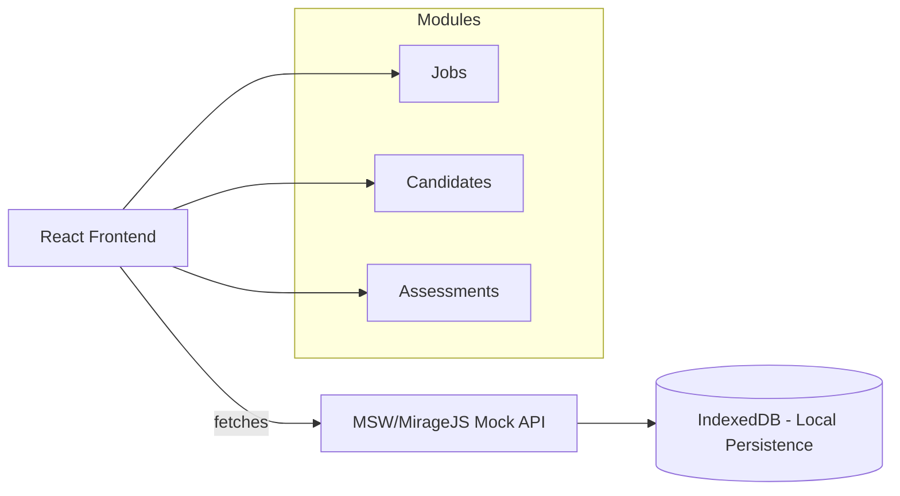

# 🌟 TalentFlow – Mini Hiring Platform  

  
  
  

TalentFlow is a **React + Next.js front-end application** that simulates a mini hiring platform for HR teams.  
It provides tools for managing **Jobs, Candidates, and Assessments** in a modern, interactive, and responsive interface.  
This project is **front-end only**, powered by simulated APIs with local persistence.  

---

## 🚀 Features  

### 🔹 Jobs Management  
- Create, edit, archive/unarchive jobs  
- Drag-and-drop reordering (optimistic UI with rollback)  
- Deep linking: `/jobs/:jobId`  
- Validation (title required, unique slug)  

### 🔹 Candidates  
- Virtualized list for 1000+ candidates  
- Client-side search & server-like filters  
- Candidate profile with timeline `/candidates/:id`  
- Kanban board to move candidates between stages  
- Notes with **@mentions**  

### 🔹 Assessments  
- Custom assessment builder (single/multi-choice, text, numeric, file upload stub)  
- Live preview & runtime validation  
- Conditional questions  
- Candidate responses persisted locally  

### 🔹 Data Layer  
- **Simulated REST API** with MSW/MirageJS  
- **IndexedDB persistence** (via Dexie/localForage)  
- Artificial latency & error injection for real-world feel  

---

## 🛠️ Tech Stack  

- **Framework:** [Next.js](https://nextjs.org/)  
- **UI:** [Tailwind CSS](https://tailwindcss.com/), custom reusable components  
- **State Management:** [React Query](https://tanstack.com/query) + [Zustand](https://github.com/pmndrs/zustand)  
- **Persistence:** IndexedDB (Dexie/localForage)  
- **Mock API:** MSW / MirageJS  
- **Drag & Drop:** [dnd-kit](https://dndkit.com/)  
- **Forms & Validation:** React Hook Form  
- **Deployment:** [Vercel](https://vercel.com/)  

---

## 🏗️ Architecture  



---

## ⚠️ Known Issues / Limitations  

- 🔄 **Job Reordering:** Works reliably **downwards**; moving **upwards** has a bug.  
- 🐢 **Kanban Board:** Sluggish with **1000+ candidates**; needs virtualization/lazy-loading optimizations.  

---

## 📦 Installation & Setup  

### 1️⃣ Clone the repository  
```bash
git clone https://github.com/username/talentflow.git
cd talentflow
```

### 2️⃣ Install dependencies  
```bash
npm install
```

### 3️⃣ Start development server  
```bash
npm run dev
```

---

## 🧠 Technical Decisions  

- **Next.js** chosen for file-based routing, optimized builds, and Vercel integration.  
- **React Query** for API state (caching, optimistic updates).  
- **Zustand** for lightweight UI state (filters, modals, drag state).  
- **IndexedDB** for local persistence across jobs, candidates, and assessments.  
- **MSW/MirageJS** to simulate API responses with latency/error injection.  
- **dnd-kit** for drag-and-drop in job list and Kanban board.  
- **React Hook Form** for advanced form handling in assessments.  

---

## 📌 Deployment  

Deployed with **Vercel** for fast previews & production builds.  
👉 [Live Demo](https://talent-flow-weld.vercel.app/)  

---

## 📄 License  

This project is licensed under the **MIT License** – free to use, modify, and distribute.  

---

